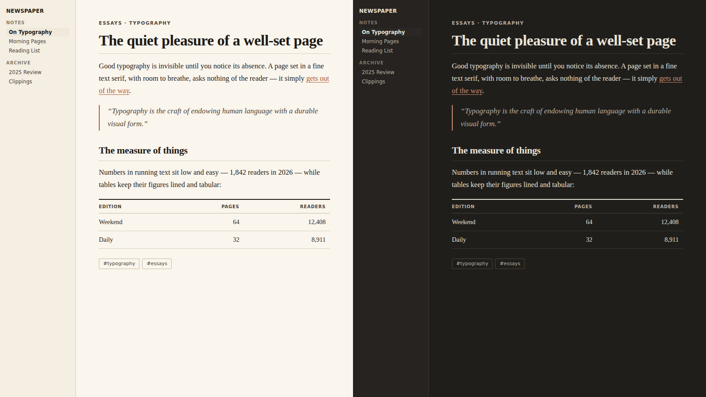
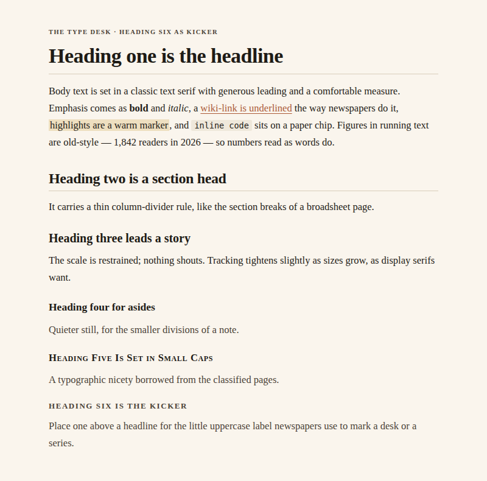
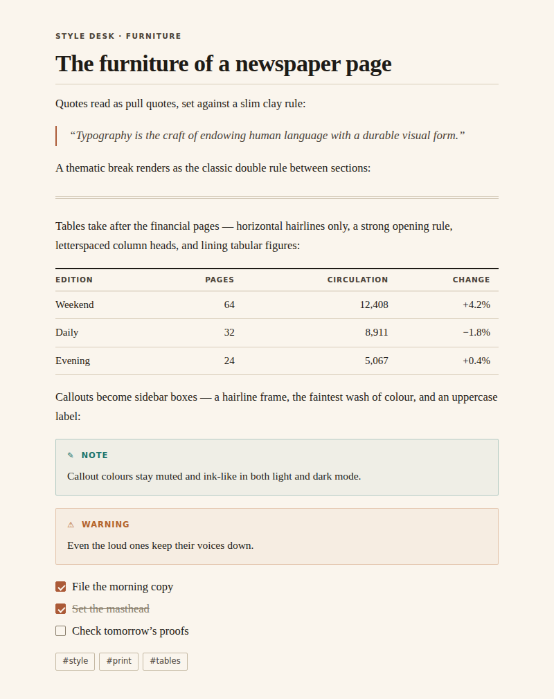
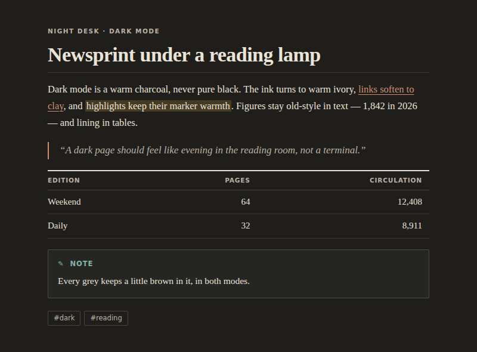

# Newspaper

A minimalist newspaper theme for [Obsidian](https://obsidian.md).

Editorial typography in the spirit of the finer papers — warm ivory paper, a
quiet interface, and serifs that are a pleasure to read and to write with.
Think the article pages of the *Financial Times* or Anthropic's essays, not
an industrial dashboard.

## Typography first

- Notes are set in a classic text serif — Charter, Iowan Old Style, or
  Georgia, whichever your system has — with generous 1.7 leading and a
  comfortable ~42 em column. No font files are bundled and no network is
  used: the theme works offline, on desktop and mobile, out of the box.
- The interface steps back into a small, quiet system sans, so your writing
  is the loudest thing on screen.
- Old-style figures in running text; lining tabular figures in tables and
  code, where numbers must line up.
- A restrained heading scale with tightened tracking on the display sizes.
  The note title acts as a masthead with a hairline rule; `H2` section
  heads carry thin column-divider rules; `H5` is set in small caps; and
  `H6` works as a **kicker** — the little uppercase label newspapers place
  above a headline.

## Newspaper furniture

- Blockquotes read as pull quotes: italic serif against a slim clay rule.
- `---` renders as the classic double rule between sections.
- Tables are financial-page tables: horizontal hairlines only, a strong
  opening rule, and letterspaced uppercase column heads.
- Callouts become sidebar boxes — hairline frame, the faintest wash of
  colour, uppercase sans label.
- Links are underlined the way newspapers do it: a hairline underline that
  darkens on hover.

## Warm, not industrial

- Light mode is warm ivory paper with near-black warm ink and a clay/claret
  accent.
- Dark mode is a warm charcoal — newsprint under a reading lamp, never pure
  black.
- Every grey is mixed with a little brown; the palette of section colours
  (used by callouts and highlights) is muted and ink-like in both modes.

*The images above are previews rendered from the theme's palette and type
styles; exact appearance in Obsidian depends on your platform's fonts and
settings.*

## Installation

### From the community themes (coming soon)

Newspaper will be submitted to the Obsidian community theme directory once
in-vault testing is complete — the plan lives in
[docs/PUBLISHING.md](docs/PUBLISHING.md). After acceptance it installs from
**Settings → Appearance → Themes → Manage**.

### Manual

1. In your vault, create the folder `.obsidian/themes/Newspaper/`.
2. Copy `manifest.json` and `theme.css` from this repository into it.
3. In Obsidian, open **Settings → Appearance → Themes** and select
   **Newspaper**.

### Via BRAT

If you use the [BRAT](https://github.com/TfTHacker/obsidian42-brat) plugin,
add `mladenpr/Newspaper` as a beta theme.

## Recommended fonts (optional)

Newspaper looks right out of the box on macOS, Windows, iOS and Android.
If you want to get even closer to the FT / Anthropic article feel, install
one of these free text serifs — the theme picks Charter up automatically,
or set the others under **Settings → Appearance → Font**:

- [Charter](https://practicaltypography.com/charter.html) — bundled with
  macOS/iOS already; a superb, screen-tuned text serif.
- [Source Serif 4](https://fonts.google.com/specimen/Source+Serif+4) —
  warm, contemporary, excellent at text sizes.
- [Newsreader](https://fonts.google.com/specimen/Newsreader) — designed
  specifically for on-screen news text.

## Tips

- The accent colour follows your own choice in
  **Settings → Appearance → Accent color**; leave it untouched to keep the
  theme's clay/claret default.
- Turn on **Readable line length** for the proper single-column measure.
- Write `###### like this` above a heading for a newspaper-style kicker.

## Versioning and releases

Newspaper uses Semantic Versioning; the rules for what counts as a patch,
minor, or major change — and the release procedure — are documented in
[VERSIONING.md](VERSIONING.md). Every notable change is recorded in the
[CHANGELOG](CHANGELOG.md). Releases are published automatically by a
[GitHub Actions workflow](.github/workflows/release.yml) when a version tag
is pushed.

## License

[MIT](LICENSE)
